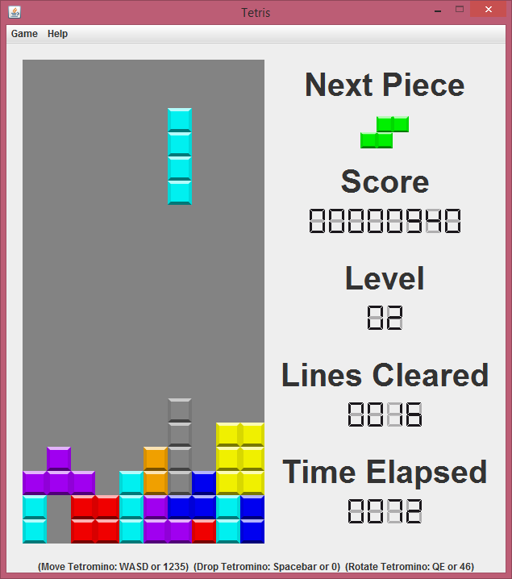

# Tetris
Tetris implemented in Java using Swing

Written as a project for:
CS 342 (Software Design), Spring 2016
University of Illinois at Chicago

Ensure the `img` folder is in the current working directory before running the game

